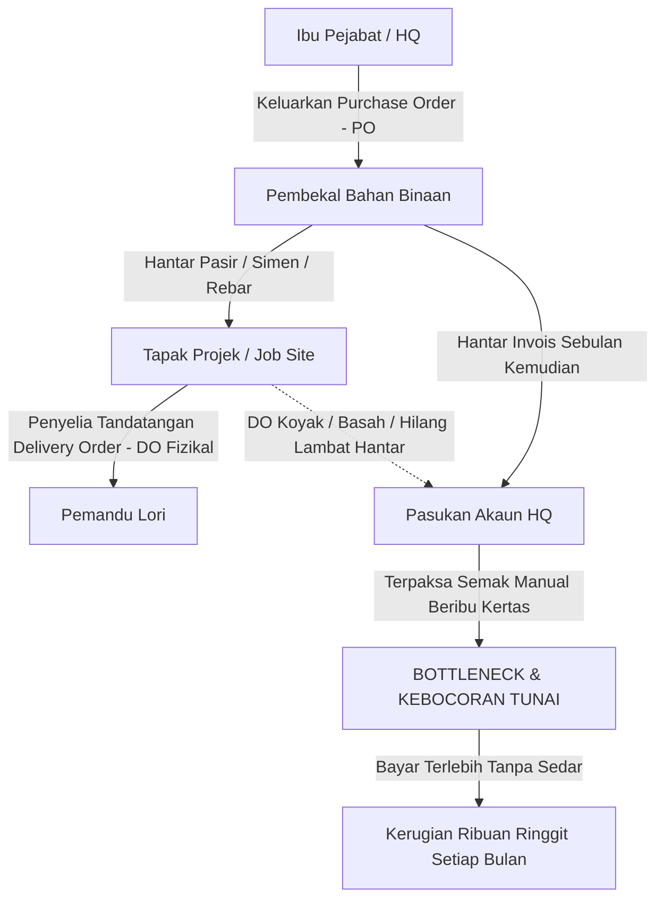
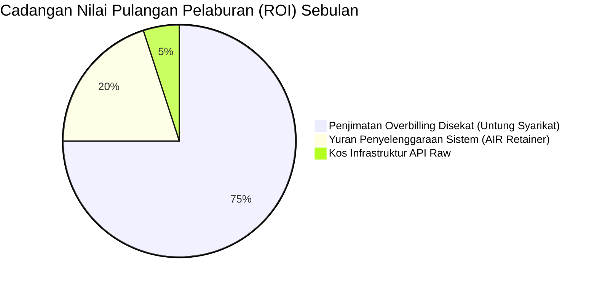

# Project AIR: Sistem Rekonsiliasi & Automasi Dokumen Kewangan Berasaskan AI
### Kertas Cadangan Komprehensif, Spesifikasi Ciri & Panduan Pelaksanaan Pelanggan (Malaysia)

---

## 1. Pengenalan Eksekutif & Masalah Industri Pembinaan di Malaysia

Dalam industri pembinaan, kejuruteraan, dan perdagangan borong di Malaysia (sama ada projek di Lembah Klang, Johor Bahru, mahupun Pulau Pinang), aliran kerja perolehan dan pembayaran adalah salah satu punca kebocoran tunai (*cash leakage*) terbesar bagi kontraktor SME:

### Masalah Sebenar (*The Bottlenecks & Real-World Flaws*):
1. **Delivery Order (DO) Hilang atau Lusuh di Tapak Projek**:
   - Pemandu lori menghantar konkrit *ready-mix* atau besi *rebar* ke tapak projek pada petang Jumaat yang hujan. 
   - Penyelia tapak (*site supervisor*) menandatangani salinan karbon DO dengan sarung tangan kotor, meletakkannya di dalam lori pikap, atau dokumen tersebut basah kuyup. 
   - Sebulan kemudian, apabila invois pembekal bernilai **RM 85,000** sampai di meja akaun HQ, kerani akaun langsung tidak menemui salinan DO fizikal tersebut.
2. **Tuntutan Terlebih Bayar (*Overbilling*) & Bahan Tidak Sampai**:
   - Pembekal mengeluarkan invois bagi **60 tan metrik keluli**, sedangkan lori yang tiba di tapak hanya menurunkan **48 tan metrik**. 
   - Kerana ketiadaan semakan silang segera (*instant 3-way matching*), kerani akaun meluluskan pembayaran penuh. Kontraktor rugi **RM 38,400** dalam satu transaksi sahaja!
3. **Kenaikan Harga Sepintas Lalu (*Price Creep*)**:
   - Harga keluli dalam Purchase Order (PO) yang dipersetujui ialah **RM 3,200/tan**, tetapi invois pembekal dinaikkan senyap-senyap kepada **RM 3,350/tan**.
4. **Proses Semakan Manual yang Menyeksakan**:
   - Menjelang tarikh tutup akaun hujung bulan, pegawai kewangan mengambil masa **3 hingga 5 hari bekerja** hanya untuk menyusun kertas fizikal satu persatu, membandingkan nombor resit, dan menaip ke dalam sistem perakaunan (seperti SQL Accounting, AutoCount, QuickBooks, atau Xero).

---

## 2. Bagaimanakah AI Menyelesaikan Masalah Ini Secara Tepat?

Project AIR menggantikan proses kertas manual dengan **enjin rekonsiliasi 3-hala (3-Way Matching Engine)** yang deterministik dan dikuasakan oleh **AI Vision (Model Multimodal)**:

| Masalah Manual Lapuk | Penyelesaian Automasi Project AIR | Impak Masa & Kewangan Nyata |
| :--- | :--- | :--- |
| Penyelia tapak perlu hantar DO fizikal ke HQ setiap minggu. | **PWA Imbasan QR Tapak**: Penyelia imbas QR guna kamera telefon, ambil gambar DO. AI ekstrak bahan dan kuantiti dalam **2 saat**. | **0 hari menunggu**. Data penerimaan fizikal masuk serta-merta ke HQ sewaktu lori masih di tapak. |
| Kerani akaun membandingkan DO, PO, dan Invois secara manual baris demi baris. | **Deterministic 3-Way Match Engine**: Komputer membandingkan kuantiti dipesan, dihantar, dan dibilkan dalam masa **0.4 saat**. | Mengurangkan masa semakan daripada **32 jam sebulan kepada 15 minit**. |
| Pembekal mengebilkan barang yang tidak dihantar atau harga dinaikkan. | **Automatik Blok Pembayaran (*Payment Hold*) & Tahanan Varians**: Sistem mengira perbezaan harga dan menahan jumlah lebihan secara automatik. | Mengelakkan kebocoran tunai purata **RM 15,000 – RM 45,000 sebulan** bagi kontraktor G5–G7. |
| Invois bercampur bahasa (Melayu, Inggeris, istilah Cina). | **Multilingual AI Standardization**: AI menukar "Besi Y12", "Steel Bar 12mm", dan "螺纹钢" kepada SKU standard bahasa Inggeris. | Menghapuskan kesilapan manusia (*human error*) semasa padanan inventori. |
| Salah kod lejar perakaunan (*wrong GL coding*). | **Smart General Ledger (GL) Auto-Tagging**: AI membaca butiran barang dan memadankan kod akaun piawai (cth: `5010-MAT`, `5020-CONC`). | Penutupan akaun bulanan siap dalam **1 hari** berbanding 2 minggu. |

---

## 3. Direktori Ciri-Ciri Utama (Feature Breakdown)

Setiap ciri di bawah diterangkan dalam **dua perspektif**:
1. **Untuk Akauntan / Pengawal Kewangan (Istilah Teknikal Perakaunan)**
2. **Untuk Pemilik Bisnes / Pengarah Projek / Orang Bukan Bidang Akaun (Senario Realiti Mudah Faham)**

---

### Ciri 1: Enjin Pemadanan 3-Hala Automatik (*Automated 3-Way Matching Engine*)

#### A. Penjelasan Untuk Akauntan:
> "Sistem melaksanakan rekonsiliasi deterministik 3 dimensi antara **HQ Purchase Order (Commitment Ledger)**, **Site Goods Received / Delivery Order (Physical Receipt)**, dan **Vendor Invoice (AP Liability Claim)**. Enjin menyemak toleransi varians harga ($P_I \le P_{PO}$) dan varians kuantiti ($Q_I \le \min(Q_{DO}, Q_{PO})$). Sebarang amaun yang tidak disokong oleh bukti penghantaran ditandakan sebagai `DISCREPANCY_FLAGGED` dan diasingkan daripada kitaran baucar pembayaran."

#### B. Penjelasan Untuk Bukan Akauntan (Senario Realiti):
> **Senario Tapak Projek**:
> Anda memesan **100 beg simen Portland** dari Pembekal A pada harga RM 22 sebeg (Jumlah PO: **RM 2,200**).
> Lori sampai di tapak hanya menurunkan **80 beg** kerana ruang lori tidak muat (Penyelia tandatangan DO untuk 80 beg sahaja).
> Dua minggu kemudian, Pembekal A menghantar invois menuntut bayaran untuk **100 beg penuh (RM 2,200)**.
> **Apa AI Buat?**
> Dalam masa 1 saat, skrin papan pemuka memaparkan amaran merah: **"AMARAN: Pembekal terlebih bil sebanyak 20 beg (RM 440)"**. Sistem secara automatik menahan RM 440 tersebut dan hanya membenarkan kerani membayar RM 1,760 untuk 80 beg yang benar-benar ada di tapak. Duit syarikat anda selamat!

---

### Ciri 2: Kelulusan Bayaran Sebahagian (*Short-Pay / Partial Payment Authorization*)

#### A. Penjelasan Untuk Akauntan:
> "Membolehkan Pengawal Kewangan (*Financial Controller*) mengeluarkan kelulusan pelepasan kredit sebahagian (*Partial Payment Approval*) bagi nilai barang yang telah disahkan penerimaannya, sambil mengeluarkan baucar potongan kredit (*Credit Memo Request*) untuk amaun varians tanpa melanggar tetingkap terma kredit pembekal (30/60 hari)."

#### B. Penjelasan Untuk Bukan Akauntan (Senario Realiti):
> **Senario Hubungan Pembekal**:
> Pembekal besi enggan menghantar besi baru selagi anda belum membayar invois tertunggak RM 50,000, walaupun ada pertikaian RM 5,000 barang kurang. Jika anda tahan keseluruhan RM 50,000, kerja pembinaan tapak terpaksa henti kerja (*work stop*).
> **Apa AI Buat?**
> Butang **"Short-Pay Approved"** membolehkan anda membayar **RM 45,000** yang sah dengan segera agar pembekal terus hantar besi esok, sementara **RM 5,000** lagi ditolak secara rasmi bersama lampiran audit lengkap. Kontrak berjalan lancar tanpa gaduh!

---

### Ciri 3: Imbasan Mobile PWA Tanpa Kata Laluan (Token QR Tapak)

#### A. Penjelasan Untuk Akauntan:
> "Aliran kerja *zero-entry capture* berasaskan token kriptografi HMAC-SHA256 yang dihadkan skop (*scoped token*). Mengesahkan identiti penyelia tapak dan tapak projek tanpa memerlukan pengurusan kata laluan pengguna yang rumit, mengelakkan risiko kebocoran kelayakan log masuk (*credential exposure*)."

#### B. Penjelasan Untuk Bukan Akauntan (Senario Realiti):
> **Senario Mandor / Penyelia Tapak**:
> Penyelia tapak berusia 50 tahun memakai sarung tangan tebal dan berdiri di tengah habuk simen. Dia tidak akan memuat turun aplikasi rumit dari App Store atau mengingati kata laluan yang panjang.
> **Apa AI Buat?**
> HQ mencetak satu pelekat kod QR di dinding pejabat tapak (*site cabin*). Apabila lori tiba, penyelia hanya buka kamera telefon biasa, imbas QR, dan tangkap gambar kertas DO. Selesai! Gambar dan kuantiti terus masuk ke komputer akaun HQ dalam masa 3 saat.

---

### Ciri 4: Pengkodan Lejar Am Automatik (*Smart General Ledger - GL Auto-Coding*)

#### A. Penjelasan Untuk Akauntan:
> "Model pemprosesan bahasa semantik (NLP) memetakan baris butiran invois ke dalam Carta Akaun (*Chart of Accounts*) piawai secara automatik. Membezakan antara Kos Barangan Dijual (*COGS - Direct Materials: 5010-MAT*), Konkrit Berstruktur (*5020-CONC*), Sewaan Jentera (*5040-EQP*), dan Perbelanjaan Operasi Keselamatan Tapak (*OPEX Safety: 6030-SAFE*)."

#### B. Penjelasan Untuk Bukan Akauntan (Senario Realiti):
> **Senario Kerani Baharu**:
> Kerani akaun baharu sering tersilap meletakkan resit topi keledar keselamatan (*hardhat*) ke dalam akaun "Bahan Mentah Bangunan", menyebabkan laporan untung rugi projek lari berpuluh ribu ringgit pada hujung tahun.
> **Apa AI Buat?**
> AI membaca perkataan pada invois. Jika nampak "Topi Keselamatan" atau "Safety Vest", ia secara automatik menandakannya di bawah kod akaun *Keselamatan Pekerja*. Jika nampak "Besi Tetulang Y16", ia terus rekod ke *Kos Bahan Mentah*. Kerani tidak perlu pening kepala memilih kod akaun satu persatu.

---

### Ciri 5: Penilaian Risiko & Tabiat Pembekal (*Vendor Risk & Friday Shortfall Analytics*)

#### A. Penjelasan Untuk Akauntan:
> "Sistem merekod metrik pematuhan pembekal berasaskan sejarah transaksi sebenar: kadar kekerapan varians kuantiti, sisihan harga invois berbanding kontrak, dan peratusan kegagalan penghantaran pada hari Jumaat (*Friday Under-Delivery Rate*). Skor risiko (Gred A, B, C) dijana untuk rundingan kontrak semula."

#### B. Penjelasan Untuk Bukan Akauntan (Senario Realiti):
> **Senario Taktik Pembekal**:
> Sesetengah pembekal tahu pekerja tapak ingin pulang awal pada petang Jumaat dan pemeriksaan barang kurang teliti. Mereka sering menghantar konkrit yang kurang 10% pada petang Jumaat.
> **Apa AI Buat?**
> Papan pemuka AI anda akan memberi amaran: *"Pembekal MegaMix mempunyai kadar kekurangan 24% pada hari Jumaat. Jumlah overbilling yang telah disekat tahun ini: RM 14,200"*. Sewaktu memperbaharui kontrak pembekal tahun depan, bos syarikat boleh meletakkan laporan ini di atas meja dan menuntut diskaun tambahan!

---

### Ciri 6: Notis Pertikaian Automatik (*Automated Dispute Dispatch via Email/WhatsApp*)

#### A. Penjelasan Untuk Akauntan:
> "Menghapuskan beban komunikasi pertikaian AP. Sebaik sahaja varians dikesan, sistem merangka surat pertikaian rasmi berserta pecahan baris demi baris nombor PO, nombor DO tapak, nombor invois, dan perbezaan matematik yang tepat untuk dihantar ke Bahagian Akaun Belum Terima (*AR Department*) pembekal."

#### B. Penjelasan Untuk Bukan Akauntan (Senario Realiti):
> **Senario Kerani Akaun Bertekak**:
> Biasanya kerani akaun terpaksa telefon pembekal berkali-kali, mengimbas kertas lama, dan berbalah mulut mengenai kuantiti yang kurang.
> **Apa AI Buat?**
> Satu klik butang **"Dispatch Dispute Notice"**, sistem terus menghantar emel/WhatsApp rasmi kepada pembekal: *"Invois #INV-8891 anda ditolak kerana terlebih bil RM 1,200 berbanding DO #DO-4421 yang ditandatangani oleh En. Razak di Tapak Seksyen 7 pada 12hb. Sila rujuk lampiran untuk salinan bertandatangan."* Pembekal tidak boleh membantah kerana bukti hitam putih ada di depan mata.

---

### Ciri 7: Eksport Baucar Perakaunan Bersih (AutoCount, SQL, QuickBooks, Xero)

#### A. Penjelasan Untuk Akauntan:
> "Hanya transaksi berstatus `APPROVED` atau `PARTIALLY_APPROVED` yang telah melalui semakan integriti Maker-Checker akan dimasukkan ke dalam fail integrasi CSV/API. Data siap dipformat dengan nombor rujukan baucar, tarikh posting, kod pembekal, kod tapak projek, jumlah diluluskan, jumlah ditahan, dan kod lejar debit/kredit."

#### B. Penjelasan Untuk Bukan Akauntan (Senario Realiti):
> Kerani akaun tidak perlu lagi menaip semula beratus-ratus resit ke dalam perisian akaun syarikat pada hujung bulan. Klik butang **"Export to ERP"**, muat naik satu fail, dan semua bil perbelanjaan masuk ke sistem perakaunan dalam masa 5 saat.

---

## 4. Anggaran Kos Infrastruktur Bulanan (Dinyatakan dalam Ringgit Malaysia - RM)

Sistem ini direka menggunakan seni bina moden tanpa pelayan (*serverless edge architecture*), menjadikan kos operasinya **sangat rendah** berbanding nilai penjimatan yang dibawanya:

*(Kadar pertukaran rasmi dianggarkan pada USD 1.00 = RM 4.45)*

### Pecahan Kos Sebenar Mengikut Penggunaan:

| Komponen Infrastruktur | Pembekal / Servis | Kapasiti Sebulan (SME Tipikal) | Kos Bulanan (RM) |
| :--- | :--- | :--- | :--- |
| **Pengekstrakan AI Vision (OCR)** | Google Gemini 2.0 Flash API | 2,000 helai dokumen (DO & Invois sebulan) *Kadar: ~USD 0.002 / dokumen* | **RM 18.00 – RM 35.00** |
| **Storan Dokumen Awan (Cloud Storage)** | Cloudflare R2 (S3 API) | 10 GB Storan Percuma sebulan Kos keluar (*Egress*): **RM 0.00 PERCUMA** | **RM 0.00 – RM 10.00** |
| **Pengehosan Web Dashboard (Frontend)** | Cloudflare Pages / Workers | Trafik tanpa had, sambungan CDN global pantas | **RM 0.00 PERCUMA** *(Pelan Asas)* |
| **Pelayan API & Enjin Logik (Backend)** | Render / Railway (Cloud Python) | 24/7 Runtime CPU & Memori Stabil | **RM 30.00 – RM 45.00** |
| **Pangkalan Data Hubungan (Database)** | Cloudflare D1 / Supabase PostgreSQL | Penyimpanan lejar audit & transaksi kewangan | **RM 0.00 – RM 25.00** |
| **Nama Domain & Sijil Keselamatan SSL** | Cloudflare SSL / MyNIC (`.com.my` / `.com`) | Perlindungan HTTPS & enkripsi perbankan | **RM 6.00** *(RM 70/setahun)* |
| **JUMLAH KOS OPERASI ASAS (RAW INFRA)** | — | — | **~ RM 55.00 – RM 120.00 sebulan** |

> [!NOTE]
> **Logik Kos AI yang Sangat Menjimatkan**:  
> Kos pemprosesan AI untuk 1 keping invois adalah kurang daripada **RM 0.02 (2 sen)**. Tetapi sekiranya invois itu mempunyai kesilapan lebihan bil sebanyak RM 2,000, pelaburan 2 sen AI tersebut telah menyelamatkan RM 2,000 wang tunai syarikat!

---

## 5. Pakej Penyelenggaraan & Sokongan Bulanan (*Monthly Maintenance Retainer*)

### Mengapa Penyelenggaraan Bulanan Diperlukan?
AI bukan perisian statik seperti Microsoft Word yang dipasang sekali dan ditinggalkan. Aliran kerja automasi berasaskan AI memerlukan pemantauan berterusan atas sebab-sebab logik berikut:

1. **Format Invois Pembekal Sentiasa Berubah**: Pembekal bahan binaan kerap menukar templat invois, fon tulisan, atau susun atur meja mereka. Sistem perlu dipantau agar pembacaan AI sentiasa tepat melebihi 98%.
2. **Kemas Kini Model AI & Prompt Engineering**: Model AI asas (seperti Gemini dan Claude) dikemas kini secara berkala oleh Google/Anthropic. Prompt sistem perlu dioptimumkan (*annealing*) agar tiada herotan format (*hallucination*).
3. **Penyandaran Lejar Kewangan & Keselamatan Data**: Salinan sandaran (*automated daily database backups*) bagi memastikan rekod audit kekal selamat sekiranya berlaku sebarang kegagalan perkakasan.
4. **Sokongan Teknikal & SLA Pantas**: Bantuan segera kepada pasukan kewangan HQ sekiranya terdapat DO atau invois yang memerlukan pelarasan peraturan padanan baharu.

---

### Cadangan Pakej Yuran Perkhidmatan di Malaysia (SME Pricing):

#### Pakej Standard SME (Kontraktor G3 – G5 / 1-3 Tapak Projek)
- **Kapasiti**: Sehingga 1,500 dokumen sebulan.
- **Yuran Pemasangan & Penyesuaian Awal (One-time Setup)**: **RM 6,500 – RM 9,000**
- **Yuran Penyelenggaraan Bulanan (*Monthly Retainer*)**: **RM 1,500 sebulan**
- **Termasuk**:
  - Semua kos infrastruktur API dan storan R2 ditanggung sepenuhnya dalam pakej.
  - Pemantauan kesihatan sistem 24/7.
  - Latihan penggunaan untuk 5 orang kakitangan (Akaun & Tapak).
  - Sandaran pangkalan data harian (*automated daily snapshots*).
  - Bantuan teknikal WhatsApp sokongan (Masa respon: < 4 jam).

#### Pakej Enterprise (Kontraktor G6 – G7 / Pemaju Hartanah / Pelbagai Tapak)
- **Kapasiti**: Dokumen tanpa had (sehingga 10,000 dokumen sebulan).
- **Yuran Pemasangan & Penyesuaian Awal (One-time Setup)**: **RM 12,000 – RM 18,000**
- **Yuran Penyelenggaraan Bulanan (*Monthly Retainer*)**: **RM 2,800 – RM 3,500 sebulan**
- **Termasuk**:
  - Semua kos API AI, pelayan awan berprestasi tinggi, dan storan R2 tanpa had.
  - Integrasi webhook terus ke perisian perakaunan (AutoCount, SQL Accounting, SAP, atau Xero).
  - Penyesuaian peraturan kelulusan bertingkat mengikut had kuasa tandatangan (*approval matrices*).
  - Pelarasan berkala model AI untuk pembekal khusus.
  - Pengurus Akaun Khusus & masa respon kritikal < 1 jam.

---

## 6. Analisis Pulangan Pelaburan (ROI Business Case)

Bagi sebuah syarikat kontraktor sederhana di Malaysia dengan purata belanja perolehan bahan binaan **RM 400,000 sebulan**:

| Metrik Kewangan | Tanpa Sistem AIR (Manual) | Dengan Sistem AIR (Automasi) | Keuntungan Bersih Syarikat |
| :--- | :--- | :--- | :--- |
| **Kebocoran Terlebih Bayar (1.5% - 3%)** | Hilang **RM 8,000 – RM 12,000 / bln** | **RM 0.00** *(Disekat serta-merta)* | **+ RM 8,000 – RM 12,000 / bln** |
| **Kos Masa Pasukan Akaun** | 40 jam kerja lewah (RM 1,800 nilai gaji) | 2 jam semakan sahaja (RM 100 nilai gaji) | **+ RM 1,700 / bln** |
| **Pertikaian Pembekal Lambat** | Bil tertunggak, denda caj faedah | Pertikaian selesai dalam 24 jam | Reputasi kredit kukuh |
| **Tolak: Yuran Penyelenggaraan AIR** | RM 0.00 | - RM 1,500 / bln | Pelaburan sistem |
| **PULANGAN BERSIH (NET GAIN) SEBULAN** | **RUGI ~RM 10,000 / bulan** | **JIMAT BERSIH** | **+ RM 8,200 – RM 12,200 SETIAP BULAN** |

> **Kesimpulan Pelaburan**:  
> Sistem ini **membayar kosnya sendiri** (*self-funding*) seawal bulan pertama penggunaan hanya melalui sekatan tuntutan terlebih bil pembekal yang berjaya dipintas.

---

## 7. Pelan Tindakan Pelaksanaan (Rollout Roadmap 14 Hari)

1. **Hari 1 – 3: Konfigurasi Tapak & Carta Akaun**
   - Muat naik senarai tapak binaan aktif dan Carta Akaun piawai syarikat (kod GL).
2. **Hari 4 – 7: Pengedaran Kod QR di Tapak Projek**
   - Cetak pelekat kod QR kalis air untuk kabin tapak.
   - Sesi latihan ringkas 15 minit bersama penyelia tapak (cara ambil gambar DO guna telefon).
3. **Hari 8 – 11: Latihan Pasukan Kewangan HQ**
   - Demonstrasi aliran semakan pemadanan 3-hala, kelulusan *short-pay*, dan eksport ke perisian akaun.
4. **Hari 12 – 14: Pelancaran Penuh (*Go-Live*)**
   - Sistem mula menyaring semua invois masuk secara automatik dengan sokongan jurutera di sisi.
